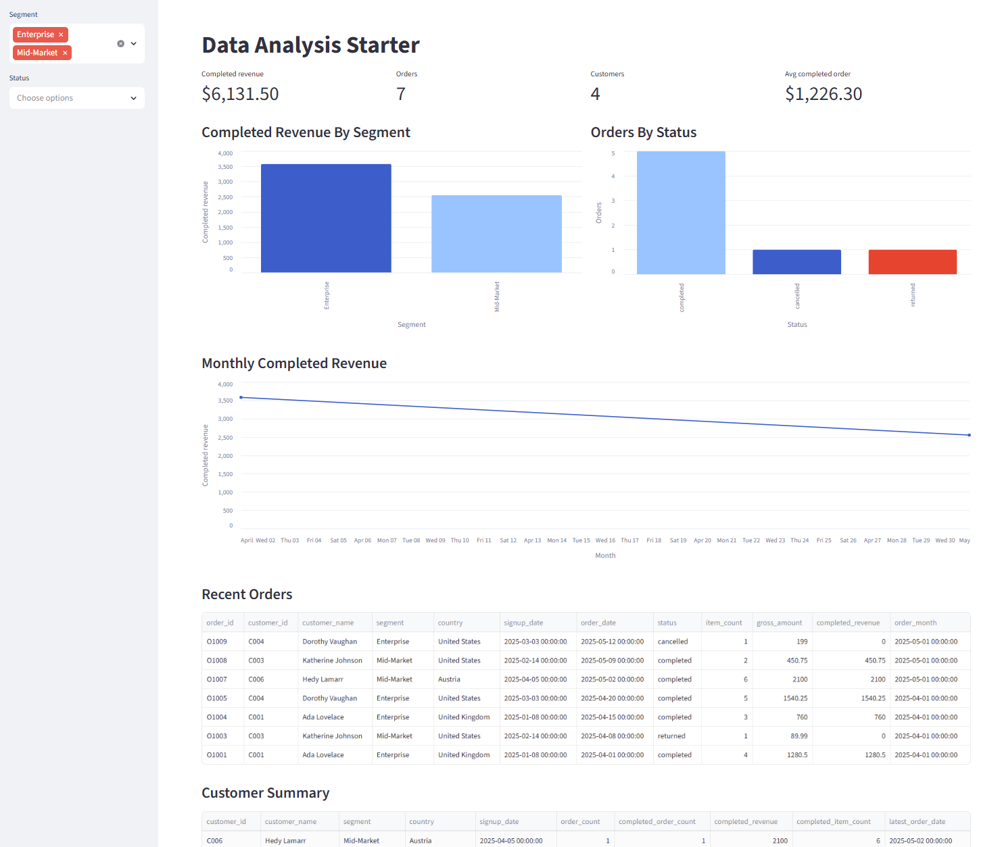

# Data Analysis Starter

A small local analytics project that turns raw customer and order files into
tested dbt models, a DuckDB database, and a Streamlit dashboard.



## What is this?

Data Analysis Starter is a minimal, runnable example of a modern local analytics
workflow:

- Raw files live in `data/raw/`.
- dbt cleans and models the data.
- DuckDB stores the local analytics database.
- Streamlit displays the dashboard.

The demo uses a customer CSV and an orders JSON file, then builds dashboard-ready
tables for revenue, order status, monthly trends, recent orders, and customer
summaries.

## Who is it for?

This starter is for analysts, analytics engineers, platform engineers and data-curious
developers who want a practical project skeleton without setting up cloud infrastructure.
It is intentionally small enough to understand quickly, but structured enough to
extend into a real analysis workflow.

## What problem does it solve?

Starting a data analysis project often means choosing tooling, wiring together
local data storage, deciding where transformations should live, and creating the
first dashboard from scratch. This repo gives you that first working version:
raw data in, tested marts out, dashboard on top.

## Run it in 5 minutes

Install dependencies:

```sh
uv sync
```

Build the DuckDB database and run dbt tests:

```sh
task dbt:verify
```

Start the Streamlit dashboard:

```sh
task dashboard
```

`task dashboard` makes a temporary copy of `./data/dev.duckdb` before starting
Streamlit. This avoids holding a read lock on the development database while you
continue iterating with dbt.

## What does the demo show?

The dashboard answers simple order and customer questions from the sample data:

- How much completed revenue has the business generated?
- Which customer segments drive revenue?
- How many orders are completed, pending, or cancelled?
- How is completed revenue trending by month?
- Which recent orders and customers should you inspect?

The dbt project separates source-shaped staging models from dashboard-ready mart
models, so the dashboard reads from clean analysis tables instead of raw files.

## What would I use this instead of?

Use this instead of:

- A blank dbt project when you want a working local example first.
- A notebook-only workflow when you want reusable models and tests.
- A cloud warehouse or BI setup for a small demo, prototype, or local analysis.
- A one-off Streamlit app that mixes raw file parsing, transformations, and UI
  code in one place.

This is not meant to replace a production data platform. It is a compact starter
for local analysis, demos, teaching, and early project exploration.

## What's included

- Sample raw data in `data/raw/`: a customer CSV and an order JSON file.
- dbt models in `dbt/models/`:
  - `staging`: cleaned, typed models that stay close to the raw files.
  - `marts`: dashboard-ready analysis tables.
- A local DuckDB database at `data/dev.duckdb`, created by dbt.
- A Streamlit dashboard in `dashboard.py` that reads the mart tables.

## Common commands

Run dbt models:

```sh
task dbt:run
```

Run dbt tests:

```sh
task dbt:test
```

Run dbt models and tests sequentially:

```sh
task dbt:verify
```

Run the dashboard:

```sh
task dashboard
```

The DuckDB Python package is installed by `uv`. The DuckDB CLI is optional, but
useful for inspecting the database directly.

## Optional DuckDB CLI

```sh
wget https://install.duckdb.org/v1.5.2/duckdb_cli-linux-amd64.zip
unzip duckdb_cli-linux-amd64.zip
mv duckdb ~/.local/bin
rm duckdb_cli-linux-amd64.zip
```

## Adapting this starter

1. Replace or add raw files in `data/raw/`.
2. Update the staging models in `dbt/models/staging/` to read, cast, rename, and
   lightly clean your raw data.
3. Add dbt tests in the staging and mart `schema.yml` files for identifiers,
   required fields, accepted values, and relationships.
4. Build reusable analysis outputs in `dbt/models/marts/`. These should be the
   tables your dashboard, notebooks, or ad hoc analysis can query directly.
5. Point `dashboard.py` at the mart tables that support your analysis.

Keep staging models source-shaped and predictable. Put joins, aggregations, and
dashboard-ready calculations in marts.
